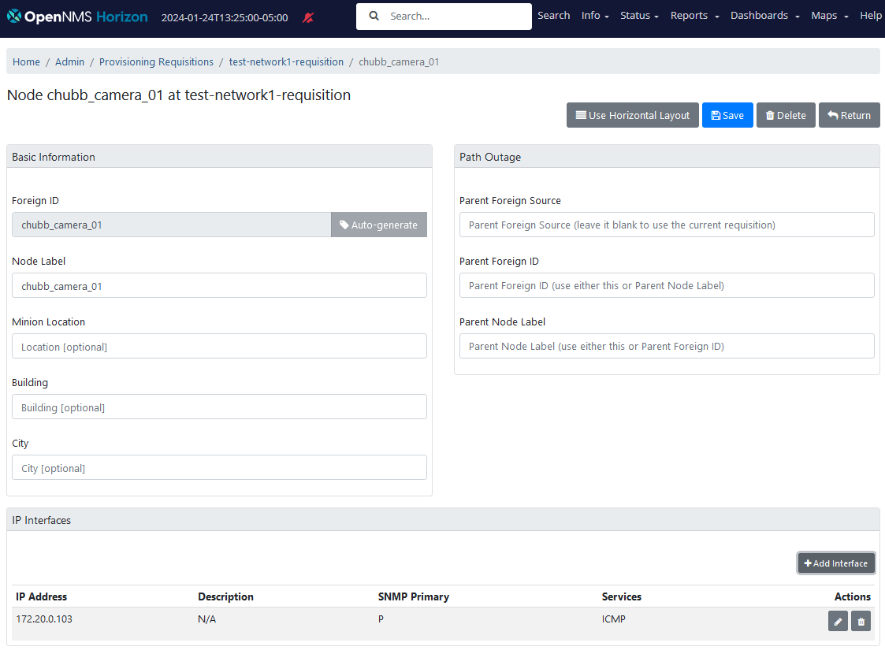
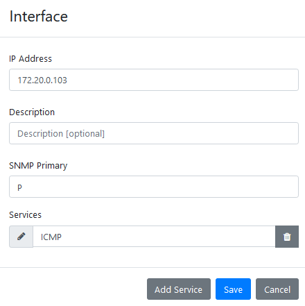
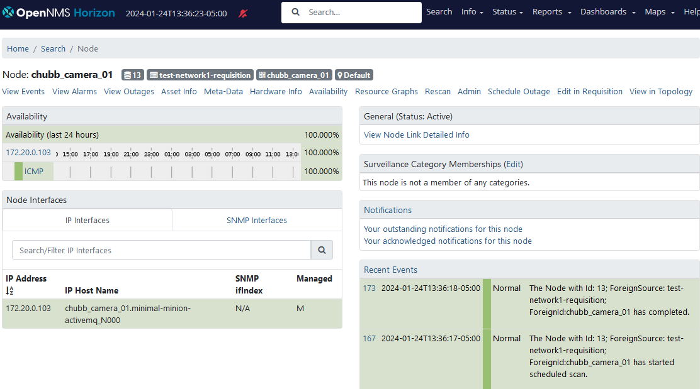
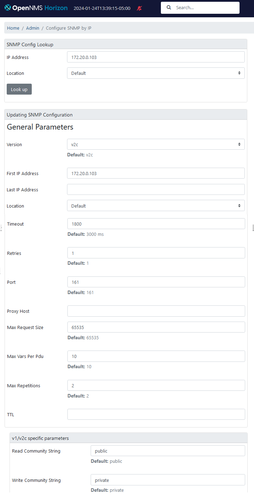
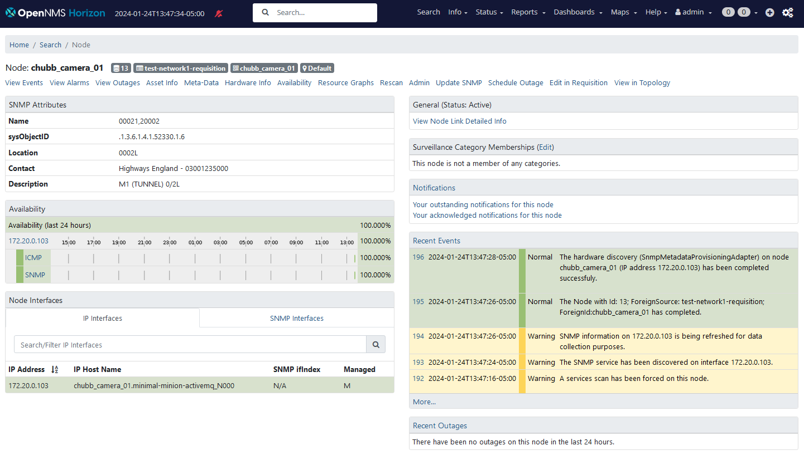

# Exercise 2-1 

[Main Menu](../README.md) | [Session 2](../session2/README.md) | [Exercise-2-1](../session1/Exercise-2-1.md)

OpenNMS uses `Requisitions` to pre-define a set of devices and services which are to be provisioned in the system. 
Requisitions can be created, viewed and modified in the GUI or through an external ReST API. 

A requisition represents a desired state of a set of nodes and services to be monitored by the OpenNMS system. 
When requisitions are `Synchronised` a process starts which matches the running OpenNMS state with the nodes in a requisition. 
The synchronisation process adds or removes nodes, interfaces or services and may also request additional discovery of services on a node.
When viewing a requisition, users can see counts of nodes which have been `provisioned` and which nodes are not yet in the database.

The docker compose [docker-compose.yaml](../session2/minimal-minion-activemq/docker-compose.yaml) example creates an example network illustrated in the following image


In this network an additional node called `chubb_camera_01` is provisioned on interface `172.20.0.103`.
The SNMP information on this node is simulated using a container running the [snmpsim project](https://github.com/etingof/snmpsim/tree/master).

We will now provision OpenNMS to monitor this new network without scanning a range of IP addresses.
Note that it is important to start this exercise with a clean database container otherwise you will duplicate a number of nodes which the OpenNMS discovered from the last example.

Start the example using:

```
cd session2/minimal-minion-activemq

# this removes the old data. OpenNMS will take longer to start up.
docker compose down -v

docker compose up -d

# you can watch the logs of OpenNMS re-initialising the database and starting using

docker compose logs -f horizon
(Ctrl-C escapes)
```

Once started, you be able to browse to the OpenNMS terminal on

http://localhost:8980/opennms

You should also be able to look at the running containers using 

```
docker compose ps

NAME                IMAGE                              COMMAND                  SERVICE             CREATED             STATUS                 PORTS
chubb_camera_01     onms-training/snmpsim              "/bin/sh -c 'snmpsim…"   chubb_camera_01     7 hours ago         Up 7 hours             0.0.0.0:11561->161/udp
database            docker.io/postgres:15              "docker-entrypoint.s…"   database            7 hours ago         Up 7 hours (healthy)   5432/tcp
horizon             docker.io/opennms/horizon:32.0.5   "/entrypoint.sh -s"      horizon             7 hours ago         Up 7 hours (healthy)   0.0.0.0:8001->8001/tcp, 0.0.0.0:8101->8101/tcp, 0.0.0.0:8980->8980/tcp, 0.0.0.0:61616->61616/tcp, 10514/udp, 0.0.0.0:10162->1162/udp
minion1             docker.io/opennms/minion:32.0.5    "/entrypoint.sh -f"      minion1             7 hours ago         Up 7 hours (healthy)   0.0.0.0:1162->1162/udp, 0.0.0.0:1514->1514/udp, 0.0.0.0:8201->8201/tcp
netsnmp_1_1         polinux/snmpd                      "/bootstrap.sh"          netsnmp_1_1         7 hours ago         Up 7 hours             161/tcp, 0.0.0.0:11161->161/udp
netsnmp_1_2         polinux/snmpd                      "/bootstrap.sh"          netsnmp_1_2         7 hours ago         Up 7 hours             161/tcp, 0.0.0.0:11261->161/udp
netsnmp_2_1         polinux/snmpd                      "/bootstrap.sh"          netsnmp_2_1         7 hours ago         Up 7 hours             161/tcp, 0.0.0.0:11361->161/udp
netsnmp_2_2         polinux/snmpd                      "/bootstrap.sh"          netsnmp_2_2         7 hours ago         Up 7 hours             161/tcp, 0.0.0.0:11461->161/udp
```

Note that the minion1 will take a minute to connect to OpenNMS and will show as `unhealthy` in the process list until it does connect so give it time to show up as a node before the next steps.

Lets look at the files inside the OpenNMS horizon container and see they match the folders discussed in the introduction

```
docker compose exec horizon bash

# check where you are in the container using pwd (present working directory)
opennms@horizon:~$ pwd
/usr/share/opennms

# look in the folders - see they match the folders discussed in the introduction
opennms@horizon:~$ ls
agent  bin  confd  data  deploy  etc  instances  jetty-webapps  karaf.pid  lib  logs  share  system

# have a look inside each folder e.g.
opennms@horizon:~$ ls logs
FilterWatcher.log  collectd.1.log.gz  eventd.log           karaf.log                opennms.pid             queued.log   telemetryd.log
ackd.log           collectd.log       instrumentation.log  karafStartupMonitor.log  perspectivepollerd.log  reportd.log  trapd.log
alarmd.log         discovery.log      ipc.log              manager.log              poller.log              rtc.log      trouble-ticketer.log
bsmd.log           enlinkd.log        jetty-server.log     notifd.log               provisiond.log          statsd.log   web.log

# have a look at the opennms-datasources.xml file and see that it has a warning that it has been created using confd
opennms@horizon:~$ cat /etc/opennms-datasources.xml

```

Now we want to provision OpenNMS from a requisition.

Navigate in the UI to `Admin / Manage Provisioning Requisitions`  to see a list of requisitions.


You will see the red `test-network1-requisition` has never been imported.

In your open terminal, look at the requisition files within OpenNMS

```
opennms@horizon:~$ ls etc/imports/
Minions.xml  pending  selfmonitor.xml  test-network1-requisition.xml

```
`Minions.xml`  and `selfmonitor.xml` have been created automatically by OpenNMS but `test-network1-requisition.xml` has been injected into the container from 
[container-fs/horizon/opt/opennms-overlay/etc/imports/test-network1-requisition.xml](../session2/minimal-minion-activemq/container-fs/horizon/opt/opennms-overlay/etc/imports/test-network1-requisition.xml)

In your UI, select the edit icon (pen) for the red test-network1-requisition


Select `synchronize` to load the requisition into the database.

Select you want to scan all nodes. 
This will tell OpenNMS to search for additional services on each node beyond the basic ICMP defined in the requisition.

If you now navigate to the info/nodes page (http://localhost:8980/opennms/element/nodeList.htm), you will see there are now 12 nodes in the system.
(you may need to refresh the page several times to see all the nodes added)

We now want to add the chubb_camera_01 to the requisition.

Select `Add Node` and then select `use vertical layout` 

enter the following information

node label : chubb_camera_01

foreign Id : chubb_camera_01 (note this replaces the randomly generated foreign id)



Select `Add Interface` and add the IP address `172.20.0.103` and service `ICMP`  (ping)



Save the requisition and `synchronize` it again.

If you look at the node list, you will see the new chubb_camera_01 node has been added. 

Select this node to look at the node page.

You will note that it has no SNMP information because the SNMP agent is not responding to requests with the default `public` community string.



Navigate to the `admin/Configure SNMP Community Names by IP Address` page.



Search for address 172.20.0.103  on the default location

Change the read and write community strings from `public` to `chubb`  and save the configuration.

When you now look at the chubb-camera_01 node page, you should see SNMP information 




## Summary

In this exercise,

* We have looked inside the container and have seen were the configuration files are located.
* We have modified and synchronised a requisition corresponding to a network of devices .
* We have set the SNMP community strings to access  a particular node.


The OpenNMS provisioning mechanism is quite complex and is supported by a number of ReST calls and also the user interface.
OpenNMS uses requisitions to externally provision nodes, interfaces and metadata.
The mechanism allows for a mixture forced provisioning and directed discovery of services or interfaces on a node.

We have also seen that internally a requisition is represented as an XML document referred to as a `Foreign Source` which contains node definitions, each uniquely referenced using a `Foreign id`. 

Within OpenNMS nodes are given a sequential database id as they are provisioned, but externally, the node is identified by it’s Foreign Source and Foreign ID. 

It is also possible to use a ReST api to provision OpenNMS through the requisition mechanism.

Requisitions can be POSTed into OpenNMS or OpenNMS can make a ReST GET request for a requisition. 
It is also possible to PUT a change to a requisition already stored within OpenNMS but a requisition is only loaded into the database when a synchronise event is sent. 
A separate ReST API can also provision the SNMP configurations.

Provisioning can be regularly scheduled or prompted through a reload requisition event injected through the OpenNMS ReST API. 
In practice each requisition should be limited to around 5000 nodes.

For more information on provisioning see [Provisioning Integration](https://docs.opennms.com/horizon/30/operation/provisioning/integration.html)

We will cover provisioning and  requisitions in more detail in a later session. 
